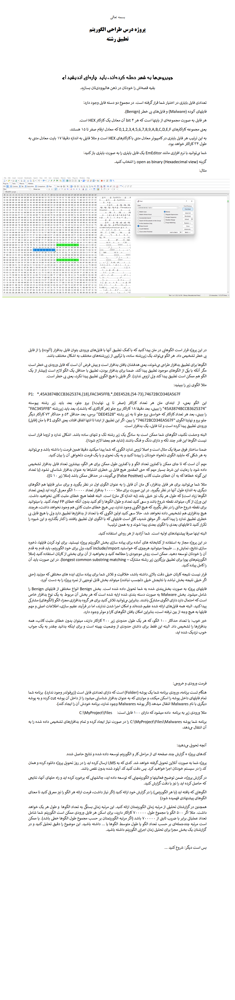

# **🦠 Antivirus System Based on Longest Common Substring Matching Project | پروژه سیستم آنتی‌ویروس بر اساس طولانی‌ترین تطبیق زیر رشته‌های رایج**

**A university project in which an antivirus program is designed using string matching.**

**یک پروژه دانشگاهی که در آن یک برنامه آنتی‌ویروس با استفاده از تطبیق رشته‌ها طراحی می‌شود.**

# 💬 **نکات پروژه**

* گزارش برنامه در دایرکتوری Report قرار دارد.
* برای اجرا برنامه، به پایتون بالاتر از نسخه 3.6 نیاز دارید.
* کتابخانه‌های مورد نیاز در فایل requirements.txt قرار دارند.
* منابع در دایرکتوری Resources قرار دارند.
* ورودی‌های برنامه در Train قرار دارند.
* برای دسترسی به همه‌ی پروژه‌های دانشگاهی من، به این لینک مراجعه کنید:

👈🏻 **[پروژه‌های دانشگاهی من](https://github.com/bestmahdi2/Uni__Bachelors_SKU_Path)**

# 📝 **توضیحات پروژه**

